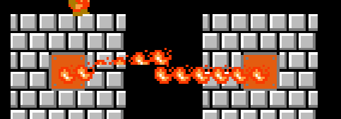
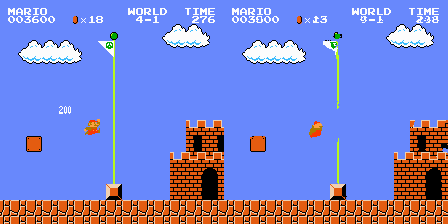
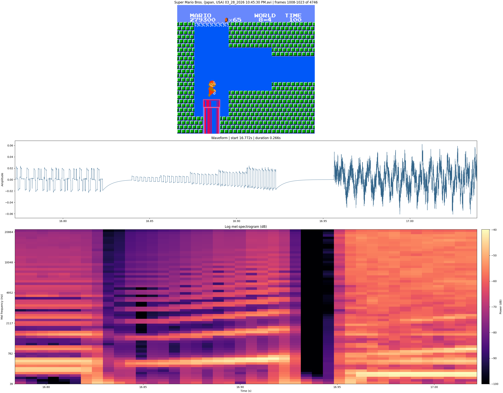

# Table of Contents

- [Single Sample Overfit Baseline](#single-sample-overfit-baseline)
- [How Does The Model Represent Counts](#how-does-the-model-represent-counts)
- [Mesen-Based Data Collection](#mesen-based-data-collection)
- [Initial Video Tokenizer Parameter Sweep](#initial-video-tokenizer-parameter-sweep)
- [Dense Cross-Entropy And NES Color Palette](#dense-cross-entropy-and-nes-color-palette)
- [Dataset Refactor Number 32515123](#dataset-refactor-number-32515123)
- [Disentangling Hidden State From RAM](#disentangling-hidden-state-from-ram)
- [SMB3 x Super Mario Land 2](#smb3-x-super-mario-land-2)
- [More Data Artifacts](#more-data-artifacts)
- [Causal Conv Temporal Padding](#causal-conv-temporal-padding)
- [Tokenizer Variables To Explore](#tokenizer-variables-to-explore)

 

  

 

# Single Sample Overfit Baseline

**Context:**

Initial tests showed that validation reconstruction was exceptionally bad. So much so that I suspected the training implementation contained a bug.

**Approach:**

As a sanity check I thought to verify the tokenizer can reconstruct a single video sequence near-perfectly.

**Result:**

The validation reconstruction was still extremely poor even on the single sample dataset.
I then found a **codebook bypass bug**: `encode()`/`decode()` skipped quantization entirely in the validation path.
This was fixed by using `tokenize()` + `decode_from_code_indices()`.

 
 

# How Does The Model Represent Counts

**Context:**

I want to know if the model has an interesting representation for any of the numeric features of the data. For ex, time, score, number of coins, lives, world-stage, mario progression through the level.

**Approach:** 

Copy (but learn from ofc) smart stuff from blogs I've seen recently.

**Result:** 

TODO

 
 

# Mesen-Based Data Collection

**Context:**

I switched data collection over to Mesen. Unlike my previous data collection scripts, Mesen can save emulator state at frequent intervals during collection, which opens the door to restarting from many points in a run instead of always from the beginning of a stage.

**Approach:** 

Mesen records raw gameplay data to disk, and an offline conversion step turns those recordings into session `.npz` files. The important next step is to use the frequent save states as replay anchors, so collection can resume from underrepresented regions and push the dataset toward a more uniform distribution over game world progression.

**Result:** 

TODO

 
 

# Initial Video Tokenizer Parameter Sweep

**Context:**

Initial training runs for small models (<2M params) trained for an hour or two were unsuccessful. I want to understand if any of the variables I know how tune will give a significant decrease in reconstruction loss.

**Approach:** 

I trained 24 configurations varying `init_dim` (32, 64), `codebook_size` (16k, 32k, 64k), model size (small, base), and attention (with/without), along with a smarter learning rate schedule.
Each model trained for 4 hours on an RTX 4090, across 8 machines.

**Result:** 

Models more or less performed similarly — at this training scale, none of the hyperparameters made a huge difference.
All models learned throughout training, with a clear, but not very steep, downward trend in loss over time.

Given the trend, I think longer training could improve quality to an acceptable degree.
Chatting with AI I found that using a different loss function would likely help.

 
 

# Dense Cross-Entropy And NES Color Palette

**Context:**

It turns out Super Mario Bros. on the NES only uses ~30 colors. Across my dataset of a million images (covering nearly the entire game), I observe just 23 distinct colors. AI suggested changing the model to use cross-entropy loss on palette probability distributions instead of MSE loss on raw RGB pixels.

**Approach:** 

It was not realistic to change only the VideoTokenizer's output shape, so I proposed changing both the input and output representations. After all, if it is easier for the decoder to produce palette probabilities, then it may also be easier for the encoder to disentangle information from that same representation. The change was straightforward — `magvit2-pytorch` exposes a "number of channels" argument that we set to the number of palette colors. As a bonus, the palette-indexed representation also provides:

- Smaller CPU->GPU bandwidth requirement
- Smaller dataset size on disk and lower network bandwidth usage

**Result:** 

The new model trained faster on my 3070, completing ~60k steps in 3 hours.
It clearly has a much better grasp of spatial layout within the image.

 
 

# Disentangling Hidden State From RAM

**Context:**

There is some hidden state surrounding 1UP mushrooms and a few other things. A transformer with a short fixed context length will not be able to learn this in training. The game's "hidden state" — which blocks have been hit, which items collected, which enemies defeated — lives in the NES's 2KB of internal RAM and is not fully recoverable from the image alone.

The NES has 2KB (2048 bytes) of internal RAM mapped to `$0000`–`$07FF`, divided into four regions:

- **Zero Page** (`$0000`–`$00FF`, 256 bytes) — The 6502 CPU's fast-access page. Games store their most frequently-read variables here because zero-page addressing modes are shorter and faster. In SMB1 this includes player position (`$0086` X, `$00CE` Y), velocity (`$0057` X speed, `$001D` Y speed), player state machine (`$000E`), moving direction (`$0045`), and the five enemy type slots (`$0016`–`$001A`). Contains some hidden state: off-screen enemy positions, scroll offsets, and physics state that may be ambiguous from a single frame.

- **Stack** (`$0100`–`$01FF`, 256 bytes) — The 6502 hardware stack, growing downward from `$01FF`. Contains return addresses and saved registers from subroutine calls. Mostly noise from the model's perspective — the values change rapidly and don't carry meaningful game state. Safe to exclude or zero-fill.

- **OAM Buffer** (`$0200`–`$02FF`, 256 bytes) — Sprite Object Attribute Memory staging area. The game writes 64 sprites × 4 bytes here (Y position, tile index, attributes, X position), then DMA transfers the whole page to the PPU each frame. This data is *derivable from the image* — it's literally what draws the sprites on screen. SMB1 rotates sprite priority every frame to work around the NES's 8-sprites-per-scanline limit, causing visible flickering in the raw data. Can be excluded since the image encoder already captures this.

- **Game Data** (`$0300`–`$07FF`, 1280 bytes) — The bulk of meaningful game state and the primary source of hidden state. Includes world/stage (`$075F`/`$075C`), lives (`$075A`), score (`$07DE`–`$07E3` BCD), coins (`$07ED`–`$07EE` BCD), timer (`$07F8`–`$07FA` BCD), gameplay mode (`$0770`), power-up status (`$0756`), level layout data, and enemy state arrays. This is where the non-recoverable information lives — which blocks have been hit, which items have been collected, warp zone flags, and the 1UP re-collection prevention flag.

Some cartridges also include **WRAM** (Work RAM, `$6000`–`$7FFF`, up to 8KB) — extra RAM on the cartridge itself, often battery-backed for save files. Games like *The Legend of Zelda* and *Kirby's Adventure* store persistent world state, map data, and save slots here. SMB1 does not use WRAM, but any general NES world model would need to account for it.

For embedding purposes, **Zero Page + Game Data (1,536 bytes)** captures all meaningful state for SMB1. Stack and OAM (512 bytes) can be dropped — they're either noise or redundant with the image. For WRAM-equipped games, the relevant WRAM region would need to be included as well.

The NES CPU runs at ~1.79 MHz (~29,781 cycles per frame), but the game loop is frame-synchronized: the PPU fires a Vertical Blank NMI (Non-Maskable Interrupt) at 60 Hz, the game logic runs atomically within that window, then idles until the next NMI. The emulator's `env.step()` advances one full NMI-to-NMI cycle and then exposes RAM — this is the only coherent snapshot where all variables agree with each other. One RAM snapshot per frame = zero information loss.

**Approach:** 

Potentially add a temporal embedding of the NES 2KB of RAM to the latent space.
Wonder how that would affect what the encoder learns to encode. Probably a shift toward more visual features?
An idea is you could side-step the image encoder altogether. Just predict pixels based on RAM embeddings.
Talking with AI about it leads me to believe using both images & RAM will perform better than either alone.
The image embeddings are a 16x16 grid of features where that grid is a spatial "bias". It may be easier
to disentangle certain spatial information from the image than it is from RAM.

Add a learned embedding of the NES RAM to the latent space via feature concatenation. A small encoder (2–3 FC layers) maps the 1,536-byte RAM vector to a D-dim embedding matching the latent channel dimension, which is then broadcast spatially to 16×16 and concatenated with the image latent. The RAM encoder trains jointly with the rest of the model.

Using both images and RAM should perform better than either alone. The image embeddings are a 16×16 grid of features with inherent spatial bias — it may be easier to disentangle certain spatial information from the image than from RAM, and vice versa.

For storage, the RAM is delta-encoded (XOR against previous frame) before `savez_compressed` — frame-to-frame deltas are ~90% zeros, and zlib compresses that extremely well.

**Result:** 

Added a NES RAM visualizer to both `play_ram_viz.py` (SMB1) and `play_nes.py --ram` (any ROM).

  

  

TODO

 
 

# SMB3 x Super Mario Land 2

**Context:**

I imagine building a SMB3 world model would be hard.
One idea I had for how to make it easier is to clean the data a bit.
Specifically fixing flickering in the smb3 status bar and removing the max 8 sprite limit.
The nes has certain limits on the max number of sprites that can appear on a scan line.
If the game attempts to draw more than the max the sprites begin to flicker in time. Example,

I do not want the model to have to spend capacity to reverse engineer exactly how this flicker mechanic works.

**Approach:**

The status bar flickering can be fixed by writing 5 bytes to the ROM file. The three `0xEA` bytes are 6502 NOP instructions, effectively disabling the code that caused the flicker. This will cause a minor floor-shaking glitch during the end credits.

| Address   | Before | After  | Note |
|-----------|--------|--------|------|
| `$3F7B2`  | `0x0D` | `0x16` | —    |
| `$3F8E0`  | `0x68` | `0xEA` | NOP  |
| `$3F8E1`  | `0x8D` | `0xEA` | NOP  |
| `$3F8E2`  | `0x10` | `0xEA` | NOP  |
| `$3F8E3`  | `0x40` | `0xEA` | NOP  |

To fix the sprite limit will require using a different emulator.
A good candidate is Mesen which also emulates sound which would be neat to learn how to model (as if an smb3 world model was't ambitions enough lol)

**Result:**

TODO

 
 

# More data artifacts

**Context:**

The model is starting to learn the finer details in the dataset and unfortunately it's learning mid-frame spilt artifacts.

BTW here is an example of a "scene-cut". This one is "natural" meaning it represents real gameplay. In this case mario reached the flag pole in 4-1 and immediately advanced to 4-2.

**Approach:** 

Check if frame spilts can be prevented with Mesen.

**Result:** 

I have not seen any frame splits with mesen but I have seen some other graphical glitches. I'm not sure if there is a reasonable way to deal with those. Luckily they are sparse and affect only a small amount of pixels.

 
 

# Causal Conv Temporal Padding

**Context:**

Reconstruction of frame 1 (0-indexed) is consistently worse than all other frames in a sample. Consider adding context frames.
Those causal conv filters will have to be "dual purpose" to account for being applied on images with zero padding. I imagine that wouldn't be very efficient.

**Approach:**

Prepend extra context frames during both training and inference. The dataset returns `seq_len + N_CTX` frames, and the loss is computed only on the final `seq_len` frames, discarding the context prefix from the output. This gives early frames real temporal context instead of zero-padding.

**Result:**

Prepending context frames works great to reduce reconstruction error on frames early in the sample. Unsurprisingly, reconstruction of the context frames is not very good.

 
 

# Tokenizer Variables To Explore

**Context:**

I'm interested in testing different LFQ params. Specifically the num_codebooks and codebook_size params. Currently num_codebooks=1 and codebook_size=65536.
I would like to test num_codebooks=2 and codebook_size=256 which will result in the overall same number of potential discrete codes and the same bottleneck dimension but would decrease the number of entries in the softmax calculation which could improve optimization performance.

Additionally I want to test a version of the video autoencoder with more context frames, a version without temporal downsampling, and a version trained on a cleaner dataset.

**Approach:**

Train more models

**Result:**

I trained a tiny model with an expanded bottleneck size and it immediately performed better than all previous models in the early training phase on a per-step basis. The key was using many smaller codebooks instead of using one huge codebook.

Context images idea worked quite nicely. Non-context images consistently have better reconstructions that context images (context image are delightfully glitched). Currently using 8 additional context images per sample.

 
 

# Audio

**Context:**

**Approach:**

Run a dataset-wide spectrum analysis over the raw Mesen AVI recordings, then pick mel front-end parameters that preserve most of the energy while staying aligned with the NES frame rate.

**Result:**

Current mel defaults for SMB1 audio:

- Sample rate: `24000` Hz mono
- Window / `n_fft`: `400` samples
- Hop length: `100` samples
- Mel bins / `n_mels`: `64`
- `fmin`: `40` Hz
- `fmax`: `8000` Hz
- Log floor: `80` dB
- STFT window: Hann

These values came from scanning the full dataset audio distribution. At `24` kHz, about `98.5%` of spectral energy is retained relative to the original audio. Only about `2.5%` of energy falls below `40` Hz, and only about `2.4%` sits above `8` kHz. A `400`-sample window is also convenient because it is almost exactly one NES video frame at `~60.1` FPS, while a `100`-sample hop gives about four mel steps per frame.

<!-- Template -->

 
 

# Title

**Context:**

**Approach:**

**Result:**

Random picture of me and my mom (her name is claudette)

