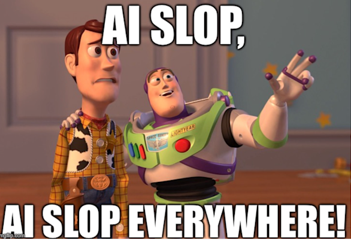
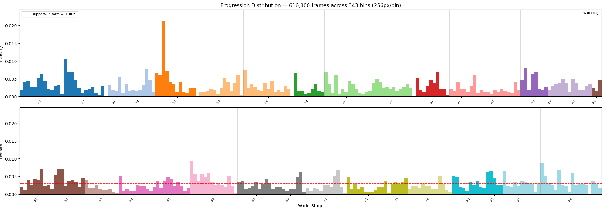
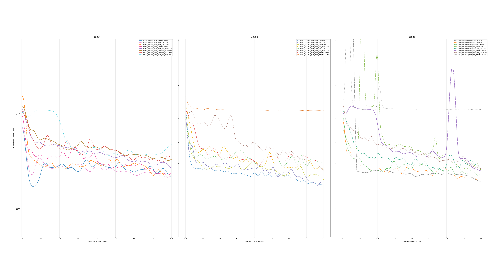
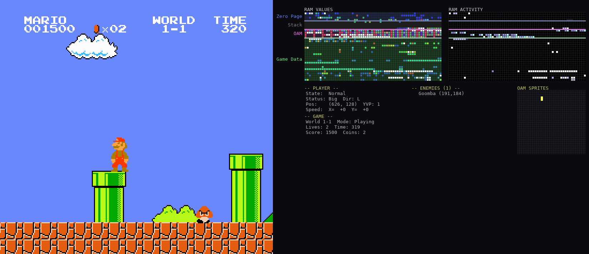
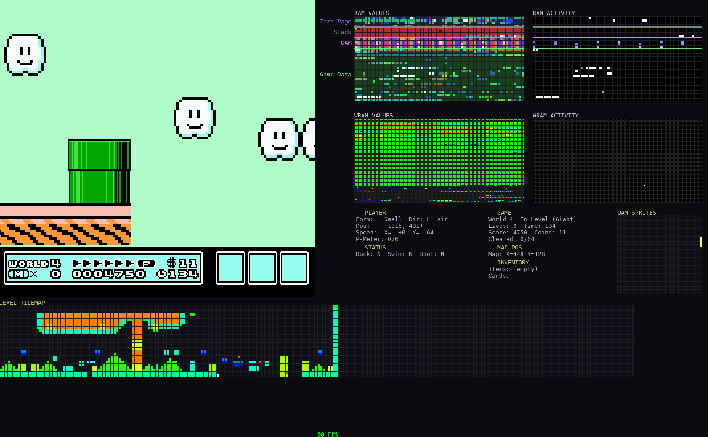
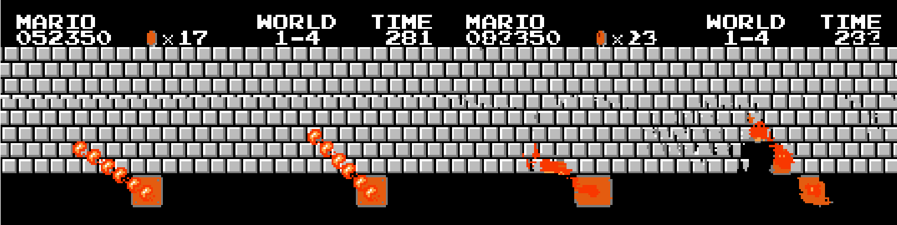

# Table of Contents

- [Single Sample Overfit Baseline](#single-sample-overfit-baseline)
- [Which Tokens Correspond To Which World And Stages](#which-tokens-correspond-to-which-world-and-stages)
- [Uniform Data Collection](#uniform-data-collection)
- [Initial Video Tokenizer Parameter Sweep](#initial-video-tokenizer-parameter-sweep)
- [Dense Cross-Entropy And NES Color Palette](#dense-cross-entropy-and-nes-color-palette)
- [Dataset Refactor Number 32515123](#dataset-refactor-number-32515123)
- [Disentangling Hidden State From RAM](#disentangling-hidden-state-from-ram)

 

  

 

# Single Sample Overfit Baseline

**Context:** Initial tests showed that validation reconstruction was exceptionally bad. So much so that I suspected the training implementation contained a bug.

**Approach:** As a sanity check I thought to verify the tokenizer can reconstruct a single video sequence near-perfectly.

**Result:**
The validation reconstruction was still extremely poor even on the single sample dataset.
I then found a **codebook bypass bug**: `encode()`/`decode()` skipped quantization entirely in the validation path.
This was fixed by using `tokenize()` + `decode_from_code_indices()`.

 
 

# Which Tokens Correspond To Which World And Stages

**Context:** 
During inference I want the initial world and stage to be configurable.

**Approach:** 
I will use the trained autoencoder to encode the initial frame for each world and stage. Those encodings will later be used as the initial tokens during inference.

**Result:** 
TODO

 
 

# Uniform Data Collection

**Context:** 
I want a uniform distribution of training data across all world/stage/x-position bins. However, the emulator can only initialize Mario at the start of a stage, so later portions of each stage are naturally underrepresented — reaching them requires playing through the earlier parts first.

**Approach:** 
During collection, every episode's actions and x-positions are recorded as rollouts. At periodic rebalance intervals the collector scans progression coverage across the existing data, computes per-bin deficits (inverse sampling weights), and builds a replay pool of recorded action sequences that reach underrepresented bins. On each episode reset, the environment samples a target bin proportional to its deficit weight, replays the corresponding recorded actions to fast-forward the emulator to that position, and then resumes live collection from there.

**Result:** 
This is not fully solved — some bins remain under represented — but the distribution is significantly more uniform than naive sequential play.

  

 
 

# Initial Video Tokenizer Parameter Sweep

**Context:**

Initial training runs for small models (<2M params) trained for an hour or two were unsuccessful. Would a better GPU help? More training steps? Different codebook size? To answer these questions, I decided to launch a larger and more organized parameter sweep.

**Approach:** 
24 configurations varying `init_dim` (32, 64), `codebook_size` (16k, 32k, 64k), model size (small, base), and attention (with/without), along with a smarter learning rate schedule. Each run trained for 4 hours on an RTX 4090, across 8 machines.

**Result:** 

  

| name | params | best MSE | final MSE | max CB usage | steps |
|------|-------:|---------:|----------:|-------------:|------:|
| dim32_cb32768_genie_small | 5.5M | 0.0154 | 0.0181 | 6,562 | 42,473 |
| dim32_cb32768_genie_base | 9.4M | 0.0161 | 0.0200 | 4,405 | 46,834 |
| dim32_cb16384_genie_base | 9.4M | 0.0165 | 0.0192 | 5,862 | 32,917 |
| dim32_cb65536_genie_base | 9.4M | 0.0174 | 0.0184 | 4,609 | 40,808 |
| dim32_cb65536_genie_small | 5.5M | 0.0174 | 0.0194 | 7,107 | 28,080 |
| dim64_cb32768_genie_small | 21.9M | 0.0179 | 0.0181 | 4,403 | 34,114 |
| dim64_cb65536_genie_small | 21.9M | 0.0181 | 0.0262 | 3,771 | 40,599 |
| dim32_cb16384_genie_small | 5.5M | 0.0186 | 0.0231 | 5,893 | 28,485 |
| dim64_cb16384_genie_small | 21.9M | 0.0190 | 0.0237 | 4,018 | 38,838 |
| dim64_cb16384_genie_base | 37.5M | 0.0202 | 0.0253 | 2,621 | 42,758 |
| dim64_cb65536_genie_base | 37.5M | 0.0202 | 0.0241 | 1,866 | 57,434 |
| dim32_cb65536_genie_small_attn | 7.0M | 0.0214 | 0.0254 | 4,547 | 43,767 |
| dim32_cb32768_genie_base_attn | 10.9M | 0.0224 | 0.0247 | 4,223 | 38,876 |
| dim64_cb32768_genie_base | 37.5M | 0.0226 | 0.0371 | 2,734 | 41,241 |
| dim32_cb65536_genie_base_attn | 10.9M | 0.0227 | 0.0244 | 4,506 | 31,674 |
| dim64_cb32768_genie_base_attn | 41.8M | 0.0233 | 0.0233 | 1,856 | 49,008 |
| dim64_cb65536_genie_small_attn | 26.1M | 0.0241 | 0.0259 | 2,723 | 46,109 |
| dim64_cb16384_genie_small_attn | 26.1M | 0.0250 | 0.0256 | 2,627 | 39,133 |
| dim32_cb32768_genie_small_attn | 7.0M | 0.0252 | 0.0305 | 6,293 | 28,740 |
| dim64_cb16384_genie_base_attn | 41.8M | 0.0255 | 0.0384 | 2,239 | 37,431 |
| dim32_cb16384_genie_base_attn | 10.9M | 0.0258 | 0.0311 | 3,927 | 37,932 |
| dim32_cb16384_genie_small_attn | 7.0M | 0.0303 | 0.0412 | 5,495 | 20,033 |
| dim64_cb32768_genie_small_attn | 26.1M | 0.0790 | 0.1085 | 35 | 38,318 |
| dim64_cb65536_genie_base_attn | 41.8M | 0.0889 | 0.1109 | 18 | 51,076 |

None of the configurations pushed the error below the target threshold (MSE < 0.0008). The best reconstruction MSE was 0.0154 (`dim32_cb32768_genie_small`). Smaller dim-32 models without attention consistently outperformed their dim-64 and attention-equipped counterparts. Two dim-64 attention runs collapsed entirely (codebook usage = 1).

Models more or less performed similarly — at this training scale, none of the hyperparameters made a huge difference.
All models learned throughout training, with a clear downward trend in loss over time.
Two of the attention models failed to utilize the codebook, and their loss remained nearly constant.

Given the downward trend, I expect that significantly longer training would bring the models much closer to convergence.

But I would rather not run this experiment for 6 days because $$$ :'( and I'm concerned the reconstructions would be more blurry than I'd like.
Chatting with AI I found that using a different loss function would likely help.

 
 

# Dense Cross-Entropy And NES Color Palette

**Context:** 
It turns out Super Mario Bros. on the NES only uses ~30 colors. Across my dataset of a million images (covering nearly the entire game), I observe just 23 distinct colors. AI suggested changing the model to use cross-entropy loss on palette probability distributions instead of MSE loss on raw RGB pixels.

**Approach:** 
It was not realistic to change only the VideoTokenizer's output shape, so I proposed changing both the input and output representations. After all, if it is easier for the decoder to produce palette probabilities, then it may also be easier for the encoder to disentangle information from those probabilities. The change was straightforward — `magvit2-pytorch` exposes a "number of channels" argument that we set to the number of palette colors. As a bonus, the palette-indexed representation also provides:

- Significantly smaller CPU->GPU bandwidth requirement, meaning faster training
- Significantly smaller dataset size on disk and lower network bandwidth usage

**Result:** 
The new model trained significantly faster on my 3070, completing ~60k steps in 3 hours.
It clearly has a much better grasp of spatial layout within the image.

 
 

# Dataset Refactor Number 32515123

**Context:** 
All previous data designs were fundamentally flawed — they used random level selection and even included completely random scene cuts mid-sequence. This project demands a dataset that reflects real game mechanics: contiguous gameplay with natural transitions only.

**Approach:** 
The old pipeline ran multiple environments in parallel, writing fixed-length chunks `(B, T, C, H, W)` with random level selection and mid-sequence scene cuts. The new pipeline produces contiguous sessions `(N, C, H, W)` — one per collection run — where every frame-to-frame transition is a real gameplay transition. The existing chunk-based dataset was converted into the new session format, and all chunk-related code was removed from the codebase.

**Result:**
Data collection now produces sessions that faithfully represent real gameplay. Training code is simpler and no longer needs to detect and skip corrupted sequences at load time.

 
 

# Disentangling Hidden State From RAM

**Context:** 
If Mario collects a 1UP mushroom then dies, then on the subsequent run through the level that mushroom cannot be collected again. A transformer with a short fixed context length will not be able to learn this in training. The game's "hidden state" — which blocks have been hit, which items collected, which enemies defeated — lives in the NES's 2KB of internal RAM and is not fully recoverable from the image alone.

The NES has 2KB (2048 bytes) of internal RAM mapped to `$0000`–`$07FF`, divided into four regions:

- **Zero Page** (`$0000`–`$00FF`, 256 bytes) — The 6502 CPU's fast-access page. Games store their most frequently-read variables here because zero-page addressing modes are shorter and faster. In SMB1 this includes player position (`$0086` X, `$00CE` Y), velocity (`$0057` X speed, `$001D` Y speed), player state machine (`$000E`), moving direction (`$0045`), and the five enemy type slots (`$0016`–`$001A`). Contains some hidden state: off-screen enemy positions, scroll offsets, and physics state that may be ambiguous from a single frame.

- **Stack** (`$0100`–`$01FF`, 256 bytes) — The 6502 hardware stack, growing downward from `$01FF`. Contains return addresses and saved registers from subroutine calls. Mostly noise from the model's perspective — the values change rapidly and don't carry meaningful game state. Safe to exclude or zero-fill.

- **OAM Buffer** (`$0200`–`$02FF`, 256 bytes) — Sprite Object Attribute Memory staging area. The game writes 64 sprites × 4 bytes here (Y position, tile index, attributes, X position), then DMA transfers the whole page to the PPU each frame. This data is *derivable from the image* — it's literally what draws the sprites on screen. SMB1 rotates sprite priority every frame to work around the NES's 8-sprites-per-scanline limit, causing visible flickering in the raw data. Can be excluded since the image encoder already captures this.

- **Game Data** (`$0300`–`$07FF`, 1280 bytes) — The bulk of meaningful game state and the primary source of hidden state. Includes world/stage (`$075F`/`$075C`), lives (`$075A`), score (`$07DE`–`$07E3` BCD), coins (`$07ED`–`$07EE` BCD), timer (`$07F8`–`$07FA` BCD), gameplay mode (`$0770`), power-up status (`$0756`), level layout data, and enemy state arrays. This is where the non-recoverable information lives — which blocks have been hit, which items have been collected, warp zone flags, and the 1UP re-collection prevention flag.

Some cartridges also include **WRAM** (Work RAM, `$6000`–`$7FFF`, up to 8KB) — extra RAM on the cartridge itself, often battery-backed for save files. Games like *The Legend of Zelda* and *Kirby's Adventure* store persistent world state, map data, and save slots here. SMB1 does not use WRAM, but any general NES world model would need to account for it.

For embedding purposes, **Zero Page + Game Data (1,536 bytes)** captures all meaningful state for SMB1. Stack and OAM (512 bytes) can be dropped — they're either noise or redundant with the image. For WRAM-equipped games, the relevant WRAM region would need to be included as well.

The NES CPU runs at ~1.79 MHz (~29,781 cycles per frame), but the game loop is frame-synchronized: the PPU fires a Vertical Blank NMI (Non-Maskable Interrupt) at 60 Hz, the game logic runs atomically within that window, then idles until the next NMI. The emulator's `env.step()` advances one full NMI-to-NMI cycle and then exposes RAM — this is the only coherent snapshot where all variables agree with each other. One RAM snapshot per frame = zero information loss.

**Approach:** 
Potentially add a temporal embedding of the NES 2KB of RAM to the latent space.
Wonder how that would affect what the encoder learns to encode. Probably a shift toward more visual features?
An idea is you could side-step the image encoder altogether. Just predict pixels based on RAM embeddings.
Talking with AI about it leads me to believe using both images & RAM will perform better than either alone.
The image embeddings are a 16x16 grid of features where that grid is a spatial "bias". It may be easier
to disentangle certain spatial information from the image than it is from RAM.

Add a learned embedding of the NES RAM to the latent space via feature concatenation. A small encoder (2–3 FC layers) maps the 1,536-byte RAM vector to a D-dim embedding matching the latent channel dimension, which is then broadcast spatially to 16×16 and concatenated with the image latent. The RAM encoder trains jointly with the rest of the model.

Using both images and RAM should perform better than either alone. The image embeddings are a 16×16 grid of features with inherent spatial bias — it may be easier to disentangle certain spatial information from the image than from RAM, and vice versa.

For storage, the RAM is delta-encoded (XOR against previous frame) before `savez_compressed` — frame-to-frame deltas are ~90% zeros, and zlib compresses that extremely well.

**Result:** 
Added a NES RAM visualizer to both `play_ram_viz.py` (SMB1) and `play_nes.py --ram` (any ROM).

  

  

TODO

 
 

# SMB3

**Context:** 
I'm interested in building an smb3 world model as well (lol). I imagine this would be MUCH harder.
One idea I had for how to make things easier would be to clean the data a bit.
Specifically fixing flickering in the smb3 status bar and removing the max 8 sprite limit.
The nes has certain limits on the max number of sprites that can appear on a scan line.
If the game attempts to draw more than the max the sprites begin to flicker in time.
I do not want the model to have to spend capacity to reverse engineer exactly how this flicker mechanic works.

**Approach:** 
The status bar flickering can be fixed by writing 5 bytes to the ROM file. The three `0xEA` bytes are 6502 NOP instructions, effectively disabling the code that caused the flicker. This will cause a minor floor-shaking glitch during the end credits.

| Address   | Before | After  | Note |
|-----------|--------|--------|------|
| `$3F7B2`  | `0x0D` | `0x16` | —    |
| `$3F8E0`  | `0x68` | `0xEA` | NOP  |
| `$3F8E1`  | `0x8D` | `0xEA` | NOP  |
| `$3F8E2`  | `0x10` | `0xEA` | NOP  |
| `$3F8E3`  | `0x40` | `0xEA` | NOP  |

To fix the sprite limit will require using a different emulator.
A good candidate is Mesen which also emulates sound which would be neat to learn how to model (as if an smb3 world model was't ambitions enough lol)

**Result:** 
Big TODO

 
 

# More data artifacts

**Context:** 
The model is starting to learn the finer details in the dataset and unfortunately it's learning mid-frame spilt artifacts.

**Approach:** 
Prompt claude more carefully for a script to find frame splits (and "unnatural" scene-cuts).
Check if frame spilts can be prevented with Mesen.

**Result:** 
TODO

<!-- Template -->

 
 

# Title

**Context:** 

**Approach:** 

**Result:** 

Random picture of me and my mom (her name is claudette)

